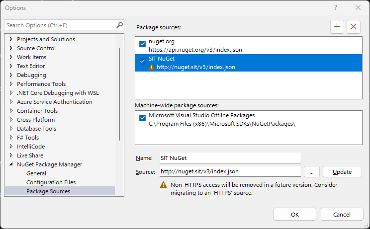
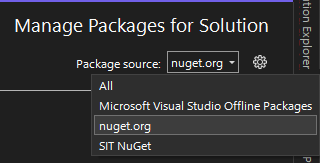
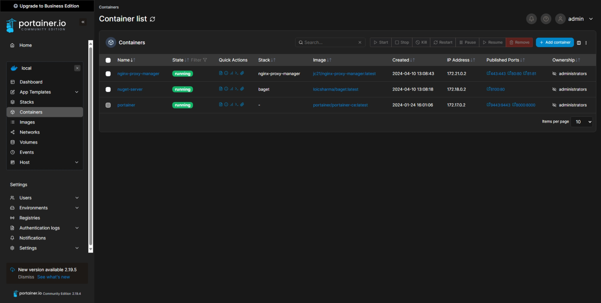
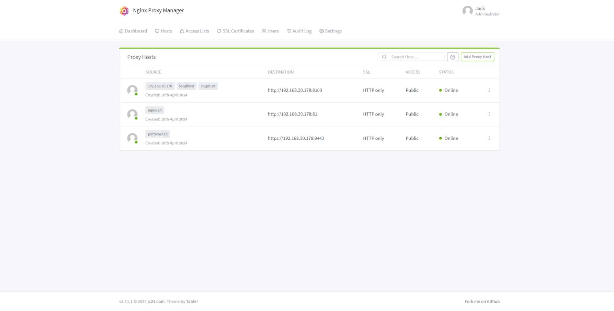

# InternalToolSetup
Quick setup for accessing internal tools easier

## Installation
To set up the tools, copy and paste the following into an admin powershell prompt.
```powershell
Set-ExecutionPolicy Bypass -Scope Process -Force; [System.Net.ServicePointManager]::SecurityProtocol = [System.Net.ServicePointManager]::SecurityProtocol -bor 3072; iex "&{$((New-Object System.Net.WebClient).DownloadString('https://raw.githubusercontent.com/SpringboardIT/InternalToolSetup/main/setup.ps1'))} global"
```

What this does:
- `Set-ExecutionPolicy Bypass -Scope Process -Force;` Temporarily disables the default `ExecutionPolicy` that prevents Powershell scripts from being run.
- `[System.Net.ServicePointManager]::SecurityProtocol = [System.Net.ServicePointManager]::SecurityProtocol -bor 3072;` Enables the script to download files from GitHub.
- `iex "&{$((New-Object System.Net.WebClient).DownloadString('https://raw.githubusercontent.com/SpringboardIT/InternalToolSetup/main/setup.ps1'))} global"` Downloads the setup script and runs it.

After running the script, you will have access to the following tools:

## SIT NuGet
SIT NuGet is a private NuGet server that hosts internal packages. It is accessible at [http://nuget.sit/](http://nuget.sit/).

### Setup SIT NuGet in Visual Studio
To set up the tools in Visual Studio, follow these steps:
1. Open the NuGet Package Manager Settings (Tools > NuGet Package Manager > Package Manager Settings)
2. Navigate to the NuGet Package Manager > Package Sources tab
3. Click the `+` button to add a new package source
4. Enter the following information:
   - Name: `SIT NuGet`
   - Source: `http://nuget.sit/v3/index.json`
5. Click `Update` to save the new package source



(Note: You may need to restart Visual Studio for the changes to take effect)

You can now install packages from the SIT NuGet server.
If you specifically want to install a package from the SIT NuGet server, or if you cannot see SIT packages in NuGet, you can select it (or "All Packages") from the package source dropdown in the NuGet Package Manager.



## SIT Portainer
SIT Portainer is a container management tool that allows the management of Docker containers. It is accessible at [http://portainer.sit/](http://portainer.sit/).



## SIT Nginx
SIT Nginx is a web server that acts as a reverse proxy, allowing the use of `*.sit` urls etc. It is accessible at [http://nginx.sit/](http://nginx.sit/).



## Note
The first time you visit these sites, ensure the trailing `/` is included in the URL.
This is because the sites are using a non-standard Top Level Domain (TLD, for example `.com`, `.uk`), and the trailing `/` is required to resolve the URL correctly.